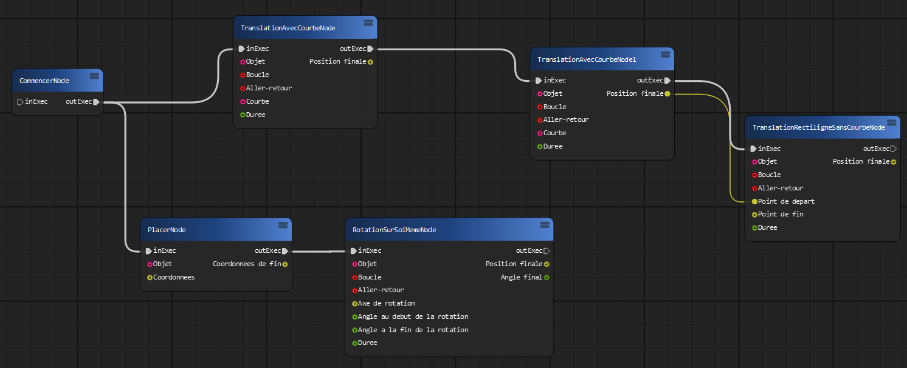
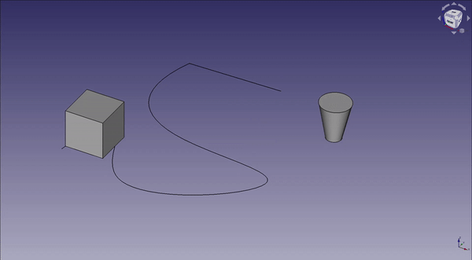

## Presentation

The FreeCAD Animation workbench allows users to animate any object easily through visual scripting Nodes thanks to [PyFlow](https://github.com/wonderworks-software/PyFlow).

**Note:**  This module use a modified version of PyFlow.

Documentation for this workbench can be found at [`AnimationFreeCAD/docs/guide`](https://github.com/QuentinTournier40/AnimationFreeCAD/tree/main/docs/guide).


## The project

We offer you a new way to create small animations on FreeCAD through visual scripting.





## Installation

### Manual Install

The FreeCAD Animation workbench is cross-platform.  
Depending on your platform, you need to first find out the path of your default FreeCAD config directory.

**Note:** After you have located the default config directory you'll need to decide on how to download the workbench. There are 2 options: `git` or via zip file.

##### Windows

On windows, this is typically in `C:/Program Files/FreeCD 0.19/Mod/`

##### Linux

In your CLI type: `/path/to/freecad --get-config UserAppData`  

##### MacOS 

In your CLI type: `/path/to/freecad --get-config UserAppData`  


### Using `git`

(**Important Note:** you may have to run your CLI in Administrator mode if you are on Windows)
```bash
cd {Your FreeCAD installation folder}
mkdir Mod/ # if there is no Mod/ directory
git clone https://github.com/QuentinTournier40/AnimationFreeCAD.git
```

### Downloading zip file

* Navigate to your `{Your FreeCAD installation folder}`. 
* Create a `Mod` directory. 
* Unzip the project in the `Mod` folder

**Note:** Make sure that the unzipped folder has not generated a sub-folder that contains the contents of the unzipped folder

Example:  
:x: `AnimationFreeCAD/AnimationFreeCAD/{Files}`  
:white_check_mark: `AnimationFreeCAD/{Files}`   

## Prerequisites

This workbench requires FreeCAD v0.19 or higher. There are also external dependencies. Install the following dependencies into the local Module directory `{Your FreeCAD installation folder}/FreeCAD/Mod`

1. **Qt.Py-master**
2. **nine**
3. **blinker-master**
4. **docutils**

You will find in the folder requirements the files of its libraries:  
`{Your FreeCAD installation folder}/FreeCAD/Mod/AnimationFreeCAD/requirements`.  
Simply copy them in the `Mod` folder of FreeCAD: `{Your FreeCAD installation folder}/FreeCAD/Mod`.

⚠️⚠️ **Note for Windows users:** After doing this you will need to run FreeCAD in **administrator mode** for the first time in order to properly load dependencies. ⚠️⚠️

---------------------------------------

### Thanks

We'd like to thank:
* [@microelly2](https://github.com/microelly2)  
* [@microelly2/NodeEditor](https://github.com/microelly2/NodeEditor)  
* [PyFlow](https://github.com/wonderworks-software/PyFlow)

## Authors

[@QuentinTournier40](https://github.com/QuentinTournier40)  
[@AndreasCottet](https://github.com/AndreasCottet)  
[@AimFried](https://github.com/AimFried)  
[@nvacher](https://github.com/nvacher)  

We are 4 students from the University of Pau and the Basque Country. We're working on a project to graduate from Computer Science.

## LICENSE
This project is released under the Apache License (see [LICENSE](LICENSE) file).
